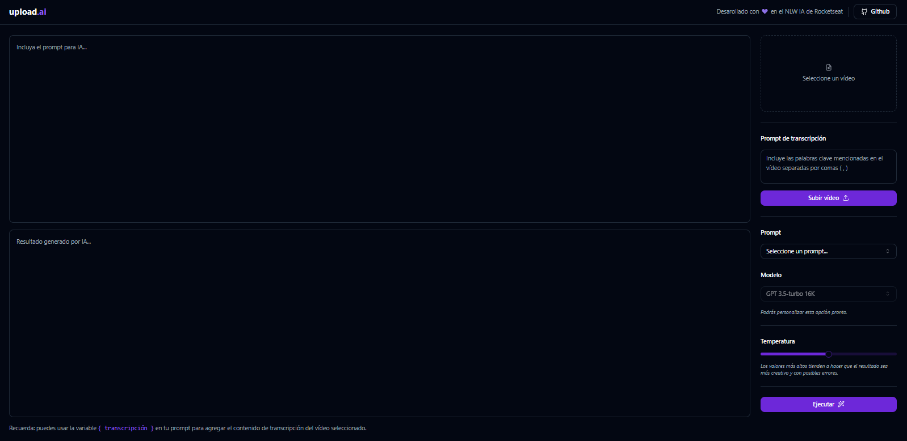
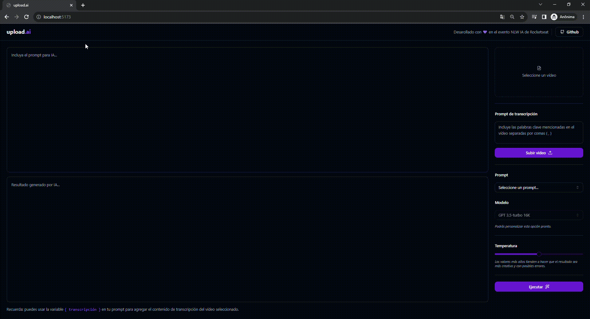

<h1 align="center">upload.ai</h1>

Desarollado con 💜 en el evento NLW IA de Rocketseat

## 💻 Proyecto

- Una herramienta que centraliza el upload de nuevos vídeos de YouTube, agregando una capa de inteligencia artificial que crea automáticamente títulos llamativos y descripciones con buena indexación y hashtags.

    

## ✒ Lenguaje

- TypeScript

## 🎮 Tecnologias

### Frontend

- [React](https://react.dev/) (con Vite)
- [shadcn-ui](https://ui.shadcn.com/docs/installation/vite)
- [Tailwind](https://tailwindcss.com/)
- [lucide-react](https://github.com/lucide-icons/lucide)
- [ffmpeg.wasm](https://ffmpegwasm.netlify.app/docs/getting-started/installation)
- [Axios](https://github.com/axios/axios)
- [ai](https://github.com/vercel/ai)

### Backend

- [Node](https://nodejs.org/en) (v18)
- [Fastify](https://fastify.dev/docs/latest/)
- [Prisma](https://www.prisma.io/) (con sqlite)
- [Zod](https://zod.dev/)
- [OpenAI](https://openai.com/)
- [ai](https://github.com/vercel/ai)

## 🚀 Como ejecutar
1. Clone el repositorio: `git clone git@github.com:esiammd/upload.ai.git`
2. Abra la carpeta del servidor: `cd upload-ai-api`
3. Ejecute en el terminal el comando: `npm install` o `yarn`
4. Haga una copia del archivo `.env.example` y llamelo `.env`
5. Rellene las variables presentes en el archivo `.env`
6. Ejecute el servidor con el comando `npm run dev` o `yarn dev`
7. Abra la carpeta de la web: `cd upload-ai-web`
8. Ejecute la web con el comando `npm run dev` o `yarn dev`

## 🎬 Vídeo de demostración

    

